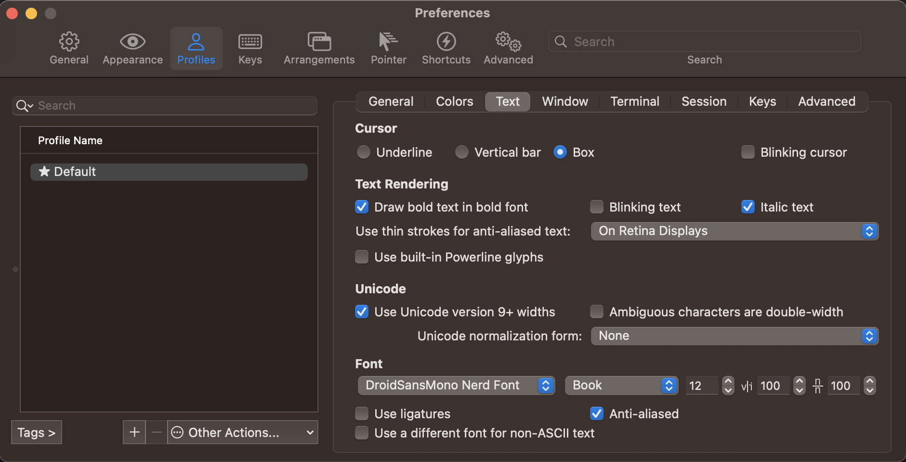
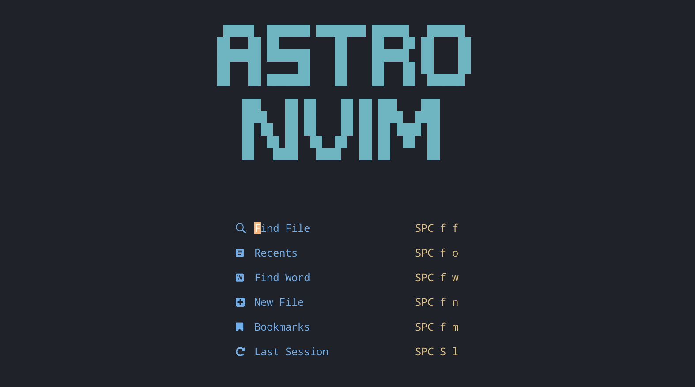
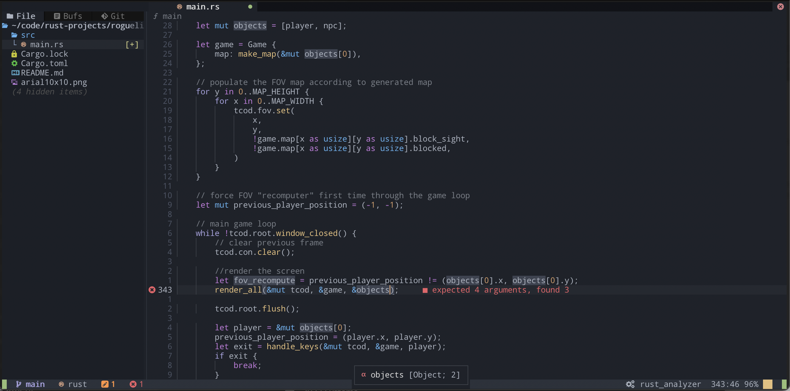

As a budding Rust programmer, I recently found myself wanting to set up a local development environment that would allow me to easily write and test code. After doing some research, I decided to give AstroNvim a try.

AstroNvim is an open-source configuration for the Neovim text editor that provides a number of helpful features for development including syntax highlighting, code completion, and error highlighting. It's designed to be easy to install and use, which makes it a great choice for anyone wanting to hit the ground running with a feature rich vim-based environment. What makes it particularly well suited for Rust development is its native Language Server Protocol (LSP) support, enabling modern editor creature comforts such as language-specific completion, references and go-to-definitions.

To get started, I first had to install Neovim on my system. Neovim is a fork of the popular Vim text editor, and it's known for its high performance and extensibility. Installing it is straightforward on most systems, and you can find instructions for your specific operating system on the [Neovim website](https://neovim.io). 

For macOS the simplest way is by using **brew**:
```bash
brew update
brew install neovim
```

I did not have a previous Neovim install or any custom configurations so I went directly to the configuration step, however you may want to back up your Neovim folder:
```bash
mv ~/.config/nvim ~/.config/nvim.bak
```

Once Neovim was installed, I had to install the AstroNvim config package. This is done by simply cloning the AstroNvim repository into the nvim configs directory. To install AstroNvim, I simply had to run the following:

```bash
git clone https://github.com/AstroNvim/AstroNvim ~/.config/nvim
nvim
```

On initial startup AstroNvim installed all the default plugins, however I noticed that some of the icons were displaying question mark boxes [?]. This was because I did not have a NerdFont installed. NerdFonts are essentially popular fonts used by us devs which have been patched with an enormous collection of glyphs -- everything from programming language icons, folders, and let's not forget about emojis. The easiest way to install a nerd font is by using [webi](https://webinstall.dev/nerdfont/):

```bash
curl -sS https://webi.sh/nerdfont | sh
```

This installed a default font called **Droid Sans Mono for Powerline Nerd Font Complete.otf**. I updated my iTerm2 font settings under Profiles > Text > Font, leaving only Anti-aliased box checked.




Glyphs were now working and the new NerdFont installed.



I then jumped into a solution but quickly discovered that many of the completion and definition features were not enabled. For this I needed to install the rust-analyzer LSP. I did this using the built in Mason package manager. Within AstroNvim I ran these commands do install the language features:
```bash
:MasonInstall rust-analyzer codelldb
```

With AstroNvim installed, I was ready to start writing Rust code! I opened up a small game project I had been working on and started typing, and I was immediately impressed by the syntax highlighting and error highlighting provided by the plugin. It was easy to see where I had made mistakes, and the code completion feature saved me a lot of time by suggesting correct syntax and names for variables and functions.



Overall, I found the process of setting up a local development environment for Rust programming with AstroNvim to be smooth and straightforward. The plugin has proven to be an invaluable tool for me as I continue to learn Rust, and I highly recommend it to other beginner Rust programmers.


